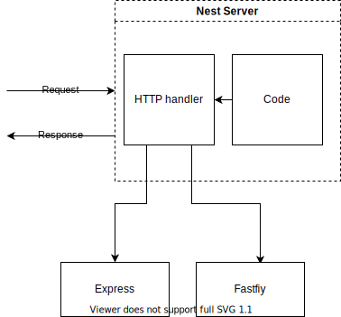
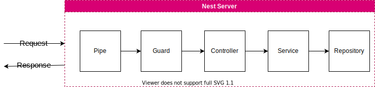
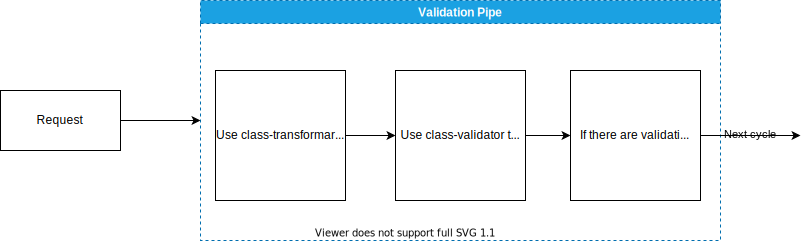
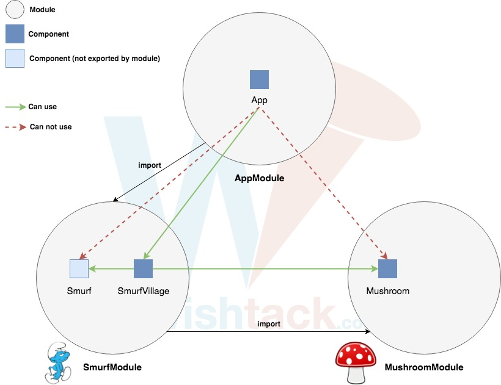

# Notes

 - Nest depeand on `express`or `fastfiy` to handle http request.
 
 ## Nest Cycle

- `Pipe` Valdiate data contained in the request
- `Guard` Make sure the user is authenticated
- `Controller` Route the request to particular function
- `Service` Run some business logic
- `Repository` Access a database

## Pipe

- `DTO` Stands for `Data Transfer Object` and it carries data between two places

## Dependency Injection

`Dependency injection` is a design pattern in which a class requests dependencies from external sources rather than creating them.

### Dependency Injection Container Flow

1. Register all classes with the conrainer
2. Container will figure out what each dependency each class has
3. Then we ask the container to create an instance of class for us
4. Container creates all required dependencies and give us the instance
5. Container will hold onto the created dependency instaces and reuse them if needed 

## Modules

The module is a collection of controllers, services, etc.

- `@Module` decorator provides metadata about module structure and it have these options:
   - ` providers `	is an instruction to the Dependency Injection system on how to obtain a value for a dependency
   - ` controllers `	the set of controllers defined in this module
   - ` imports `	the list of imported modules that are required in this module
   - ` exports ` control the visability of module components outside module.

The ` module ` encapsulates providers by default.

## Miscellaneous

- `@nestjs/common` Contain vast majority of nest function classes etc
- `@nestjs/platfrom-express` Let nest use express.js for handling http request
- `reflect-metadata` Make decorators work
- `Controller` Decorator that marks a class as a Nest controller that can receive inbound requests and produce responses
- `Get` Route handler (method) Decorator. Routes HTTP GET requests to the specified path.
- Controllers: Handle incoming requests
- Services: Handle data access and business logic
- Modules: Groups together code
- Pipes: Validates incoming data
- Filters: Handles errors that occur during request handling
- Guards: Handles authentication
- Interceptors: Adds extra logic to incoming requests or outgoing responses
- Repositories: Handles data stored in a Databases
