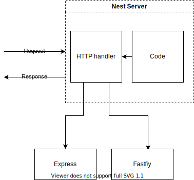

# Notes

- `@nestjs/common` Contain vast majority of nest function classes etc
- `@nestjs/platfrom-express` Let nest use express.js for handling http request
- `reflect-metadata` Make decorators work
- `Controller` Decorator that marks a class as a Nest controller that can receive inbound requests and produce responses
- `Get` Route handler (method) Decorator. Routes HTTP GET requests to the specified path.

### Nest Parts

- Controllers: Handle incoming requests
- Services: Handle data access and business logic
- Modules: Groups together code
- Pipes: Validates incoming data
- Filters: Handles errors that occur during request handling
- Guards: Handles authentication
- Interceptors: Adds extra logic to incoming requests or outgoing responses
- Repositories: Handles data stored in a Databases
